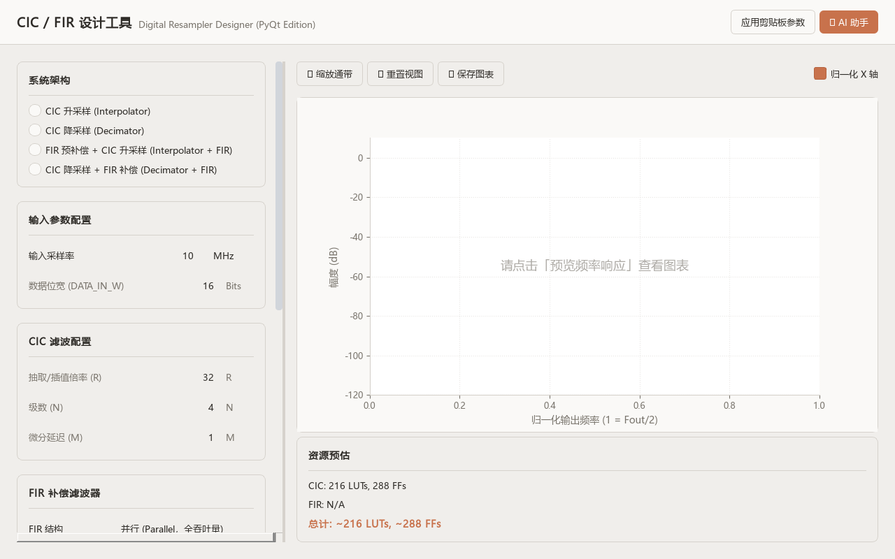
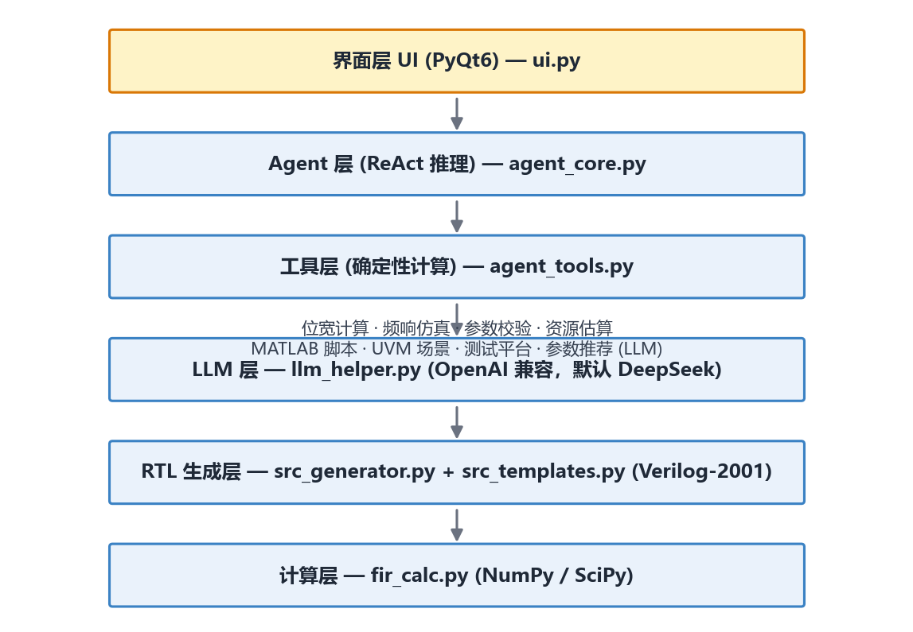
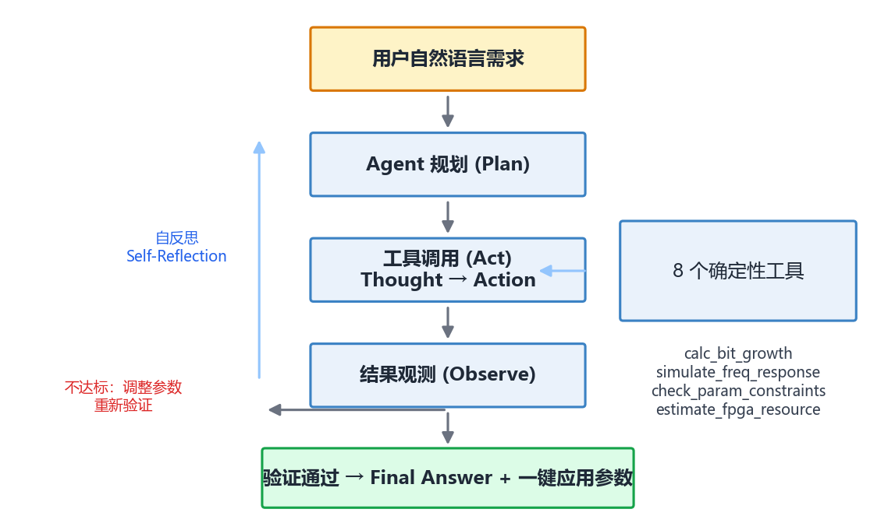
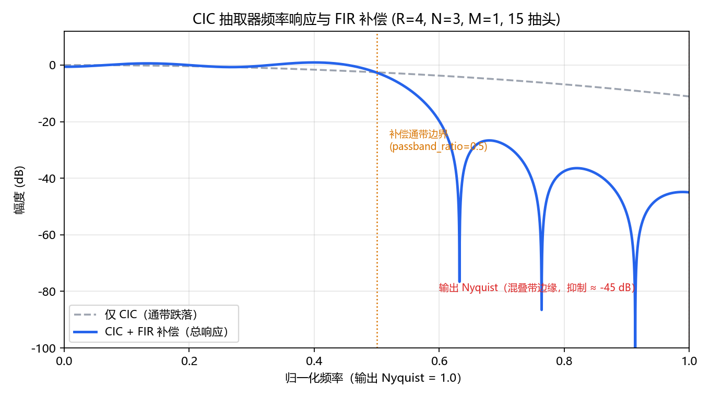

# CIC Design Studio —— 数字升降采样器自动设计工具

基于 **AI Agent（ReAct 范式）** 的数字升降采样器自动设计工具：从自然语言设计需求出发，自动完成 **参数推荐 → 频响验证 → RTL 生成 → 协同仿真验证** 的完整闭环，面向 FPGA 实现。

支持 CIC（级联积分梳状）抽取器 / 插值器及其 FIR 补偿滤波器的自动化设计，生成的 Verilog-2001 代码可在 Vivado 中直接综合。



## 功能特性

- **四种设计模式**，输出参数化、可综合的 Verilog-2001 代码：
  - `Decimator` —— CIC 抽取器（降采样）
  - `Interpolator` —— CIC 插值器（升采样）
  - `Decimator_FIR` —— CIC 抽取 + FIR 通带补偿
  - `Interpolator_FIR` —— FIR 预补偿 + CIC 插值
- **FIR 补偿滤波器自动设计**：基于 `firls` / `firwin2`，定点系数自动定标，支持并联 / 串联 / 分布式算术三种结构，对称预加器优化可高效映射到 DSP 资源（15 抽头仅需 8 个 DSP48E1）。
- **ReAct 智能设计 Agent**：自动规划并调度 8 个确定性工具，形成完整验证闭环。
- **协同仿真验证**：自动生成自检测试脚本，将 RTL 输出与 Python 参考模型逐样本对比（脉冲 / 阶跃 / 正弦三种激励）。
- **PyQt6 图形界面**：参数面板、频率响应实时预览、FPGA 资源估算、AI 对话（一键应用推荐参数）、会话历史管理。
- **多种复位风格**：Xilinx（同步高有效）、Altera（同步低有效）、ASIC（异步低有效）。

## 架构

工具采用五层架构，上层通过 Agent 编排调用下层确定性工具，LLM 只负责推理与规划，所有数值计算均由确定性算法完成：



```
┌─────────────────────────────────────┐
│  界面层 (PyQt6) — ui.py             │
├─────────────────────────────────────┤
│  Agent 层 (ReAct) — agent_core.py   │
├─────────────────────────────────────┤
│  工具层 (确定性计算) — agent_tools.py│
├─────────────────────────────────────┤
│  LLM 层 — llm_helper.py             │
├─────────────────────────────────────┤
│  RTL 生成层 — src_generator.py      │
│  + src_templates.py (Verilog-2001)  │
├─────────────────────────────────────┤
│  计算层 — fir_calc.py (NumPy/SciPy) │
└─────────────────────────────────────┘
```

## Agent 工作流程



Agent 遵循 ReAct（Reason + Act）模式：规划执行计划 → 调用确定性工具 → 观测结果 → 不达标时自我反思并调整参数重新验证 → 验证通过后给出最终答案并附带可一键应用的参数 JSON。内置工具调用缓存、重复调用熔断与格式纠错重试机制。

## 频率响应示例

以抽取比 R=4、级数 N=3、15 抽头补偿 FIR 为例，工具计算得到的频率响应如下：



- 补偿通带内（passband_ratio=0.5 以内）总响应保持平坦（纹波 < 1 dB）；
- 通带外 FIR 自然滚降，在输出 Nyquist（混叠带边缘）处总抑制约 -45 dB，保留 CIC 本身的抗混叠能力；
- 频响曲线由工具实时计算，可在界面中随参数调整即时预览。

## 下载与安装

### 环境要求

- Python 3.10+
- Windows / Linux / macOS
- 可选：iverilog（运行协同仿真）、Vivado（综合验证）

### 获取代码

```bash
git clone https://github.com/enpropy86/cic-design-studio.git
cd cic-design-studio
```

### 安装依赖

```bash
pip install -r requirements.txt
```

### 配置 LLM API

工具调用 **OpenAI API 格式兼容** 的对话接口完成智能对话与自然语言参数推荐，全部通过环境变量配置，**代码中不包含任何 API Key**。

#### 默认配置：DeepSeek + deepseek-v4-flash

只需设置 API Key 即可使用，模型与接口地址均带默认值：

```bash
# Windows (PowerShell)
$env:DEEPSEEK_API_KEY = "sk-你的DeepSeek密钥"
```

| 环境变量 | 默认值 | 说明 |
|---|---|---|
| `DEEPSEEK_API_KEY` | 必填，无默认值 | DeepSeek API Key（在 https://platform.deepseek.com 获取） |
| `DEEPSEEK_MODEL` | `deepseek-v4-flash` | 对话模型名称 |
| `DEEPSEEK_API_URL` | `https://api.deepseek.com/chat/completions` | OpenAI 兼容接口地址 |

默认使用 **deepseek-v4-flash**（dsv4f）模型，不需要额外配置。

#### 使用其他模型

##### 切换 DeepSeek 的其他模型

```bash
$env:DEEPSEEK_API_KEY = "sk-你的DeepSeek密钥"
$env:DEEPSEEK_MODEL   = "deepseek-chat"        # 或 deepseek-reasoner
```

##### 使用 OpenAI 模型

```bash
$env:DEEPSEEK_API_KEY = "sk-你的OpenAI密钥"
$env:DEEPSEEK_MODEL   = "gpt-4o"               # 或 gpt-4o-mini 等
$env:DEEPSEEK_API_URL = "https://api.openai.com/v1/chat/completions"
```

##### 使用其他 OpenAI 兼容服务（通义 / Kimi / 智谱 / vLLM / Ollama 等）

任何提供 OpenAI 兼容 `/chat/completions` 接口的服务均可接入，只需修改 `DEEPSEEK_API_URL` 与 `DEEPSEEK_MODEL`：

```bash
# Windows (PowerShell)
$env:DEEPSEEK_API_KEY = "你的服务商密钥"
$env:DEEPSEEK_MODEL   = "qwen-max"             # 按服务商模型名填写
$env:DEEPSEEK_API_URL = "https://dashscope.aliyuncs.com/compatible-mode/v1/chat/completions"  # 例：阿里云百炼

# Linux / macOS
export DEEPSEEK_API_KEY="你的服务商密钥"
export DEEPSEEK_MODEL="qwen-max"
export DEEPSEEK_API_URL="https://dashscope.aliyuncs.com/compatible-mode/v1/chat/completions"
```

常见服务商配置参考：

| 服务商 | `DEEPSEEK_API_URL` | 模型示例 |
|---|---|---|
| DeepSeek（默认） | `https://api.deepseek.com/chat/completions` | `deepseek-v4-flash` / `deepseek-chat` / `deepseek-reasoner` |
| OpenAI | `https://api.openai.com/v1/chat/completions` | `gpt-4o` / `gpt-4o-mini` |
| 阿里云百炼（通义千问） | `https://dashscope.aliyuncs.com/compatible-mode/v1/chat/completions` | `qwen-max` / `qwen-plus` |
| Moonshot（Kimi） | `https://api.moonshot.cn/v1/chat/completions` | `moonshot-v1-8k` 等 |
| 智谱 GLM | `https://open.bigmodel.cn/api/paas/v4/chat/completions` | `glm-4-plus` 等 |
| 本地 vLLM | `http://localhost:8000/v1/chat/completions` | 你部署的模型名 |
| 本地 Ollama | `http://localhost:11434/v1/chat/completions` | `llama3.1` 等 |

> **说明**：LLM 只负责设计意图理解、参数推荐与对话；所有数值计算（位宽、频响、系数、资源估算）均由本地确定性算法完成。更换模型或完全关闭 LLM 都不影响 RTL 生成与验证的正确性。

#### 不配置 API Key 时

全部确定性功能（参数设计、频响验证、RTL 生成、协同仿真、MATLAB 脚本生成等）均可正常使用；仅 AI 对话与自然语言参数推荐不可用。

## 快速开始

### 启动图形界面

```bash
cd py
python main.py
```

### 无头模式生成 RTL

```python
import src_generator as sg

params = dict(type="Decimator_FIR", filename="my_dec", data_w=16, ratio=4,
              stages=3, delay=1, fir_taps=15, fir_passband=0.5, fir_width=16)
sg.generate_single_file(params, "my_dec.v")
```

### 生成协同仿真测试脚本

```python
from tb_generator import generate_testbench

params = dict(type="Decimator_FIR", filename="my_dec", data_w=16, ratio=4,
              stages=3, delay=1, fir_taps=15, fir_passband=0.5, fir_width=16)
generate_testbench(params, "my_dec_test.py")
```

生成的测试脚本包含 Python 参考模型与 Verilog 协同仿真逻辑，安装 iverilog 后直接运行即可得到 PASSED/FAILED 结论：

```
Impulse: PASSED
Step:    PASSED
Sine:    PASSED
ALL TESTS PASSED!
```

## 验证情况

工具经过以下独立验证（Vivado 2023.2 + XSim，参数 R=4 / N=3 / M=1 / 16bit / 15 抽头）：

| 验证项 | 结果 |
|---|---|
| 频率响应公式 vs 直接 H(z) 求值 | 最大误差 < 1e-15 |
| 四种模式 RTL vs Python 参考模型（脉冲/阶跃/正弦） | 逐样本一致（Decimator / Interpolator / Decimator_FIR） |
| Vivado 2023.2 综合 | 四种模式均 0 errors / 0 critical warnings |
| 与 Xilinx CIC Compiler IP (v4.0) 交叉验证 | 抽取器与插值器输出数值逐样本一致（仅输出相位与流水延迟不同） |
| FIR 资源映射 | 15 抽头对称预加结构 → 8 × DSP48E1 |

## 项目结构

```
py/                 工具源代码（入口：py/main.py）
  agent_core.py     ReAct 推理引擎
  agent_tools.py    确定性工具注册表
  llm_helper.py     LLM API 客户端（环境变量配置）
  src_generator.py  RTL 生成器
  src_templates.py  Verilog-2001 模板
  tb_generator.py   协同仿真测试平台生成器
  fir_calc.py       DSP 计算（NumPy/SciPy）
images/             README 配图
```

## 许可证

本项目基于 [MIT License](LICENSE) 开源。
